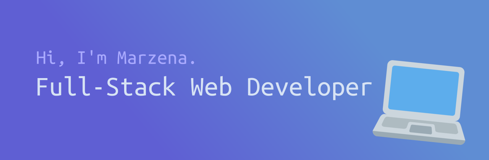

## 🎮 Work
I've been working at [DeepL](https://deepl.com) as a Tooling Engineer since March 2024.

## 🐝 Personal projects
- [cws2](https://github.com/m5ka/cws2) - a language documentation website (python)
- [naoi](https://github.com/m5ka/naoi) - a lightweight self-hosted ci/cd platform (go & typescript)
- [moku.blog](https://github.com/m5ka/moku.blog) - a food blogging website for the yesterweb (python)
- [scago](https://github.com/m5ka/scago) - a sound change applier for languages (go)
- [maria.town](https://github.com/m5ka/maria.town) - my personal website (jekyll & html/css)

## ⭐ My skills
**Back-end**

**Front-end**

**Everything else**

